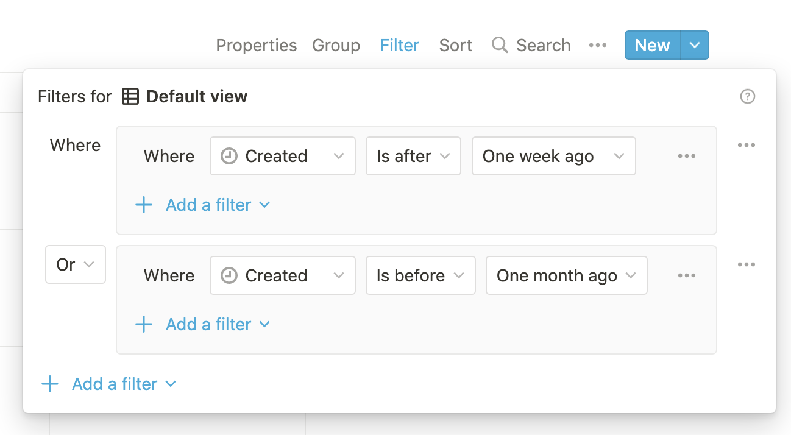
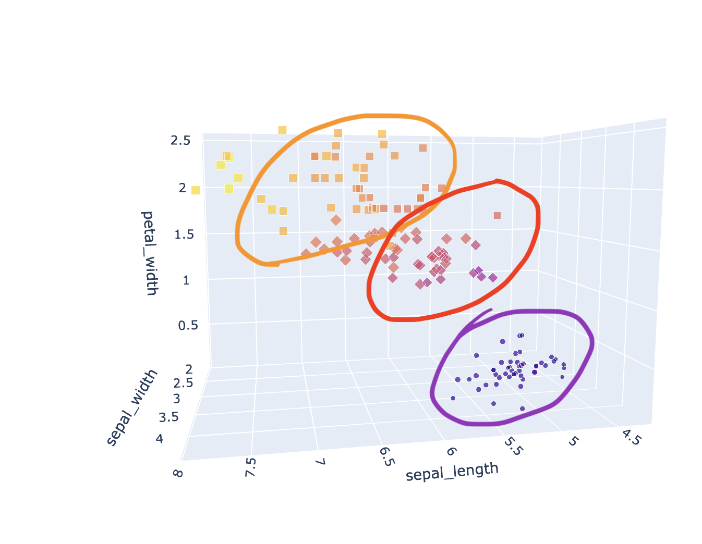

Jean was searching for a new place. He's a frequent mover, this was the 2nd time
in last half a year. He's moved places 5 times in the last 3 years.

Jean already had a good sense of what it entails — he looks up several property marketplace websites,
he compares which ones are more popular, and which ones favour ads from landlords vs letting agents.
He choses one or two, to avoid overburderning himself.

He knows that the photos and description rarely paint the full picture. The descriptions are overflowing with
only the _best_ superfluous adjectives. The photos have _impossible_ angles like it's early 2000's. But you can barely see anything on the photos anyway, because they're overexposed so much you can't tell where a wall starts and where the furniture ends.
_"It's kind of like advertising. Over time, you become desensitised. You stop noticing those things
and focus just on the factual points"_, said Jean.

What are these points? Location for one, and price for sure.
<br/>
Are there glazed windows? Yes / No.
<br/>
Does it have a washing machines? Yes / No.
<br/>
Is it on a busy street? Yes / No.

And just like that, Jean can turn the ad — laden with emotional
traps — into something that's easier for him to digest: _a dataset_.

Jean has interesting likings. He's a frugal chap, but he likes to have plenty of space in his
rented kingdom. And so when he considers the data, right next to columns "monthly cost" and "travel time",
you would find the average price per square meter, the cost of travel, and more.
Not all property listings include details like that, and Jean is already used to the fact.
It's even more rare so to enable to sort or filter the ads based on these conditions.

Jean was living by himself, but he's _"not an old snarly hermit... just yet!"_, he said laughing,
as he explained that he was considering two options. He could either look for something smaller,
like a 50-60 m2 single bedroom flat for 400-600 EUR. Or he could move in with 1-2 other people,
together living in a 100+ m2 two or three bedroom flat for 1000-1500 EUR. _"I'm not hard-pressed either way"_,
he added.

The websites Jean used for search are like any other, and so Jean had to search for
the 50-60 m2 single bedroom flats for 400-600 EUR. And then he had to search for
the 90-100 m2 two bedroom flats for 800-1200. And then he had to search for
the 140-150 m2 three bedroom flats for 1200-1500. And then... kidding, he stopped there he claimed.

_"You would've thought this is something so common that they_ [the property websites] _would make
it easier to search for these kind of things in one go"_, he starts. _"When you have to search one-by-one,
there's no easy way to compare the flats between the searches. Which flat is more cost effective,
the larger one in the city centre, or a smaller one bit further out? In the end, I scraped the data
from the website, just so I could put it into a spreadsheet. I've put it into a spreadsheet, did the math
there, and finally I could decide which properties to prioritise."_

_"That's... quite a lot just to find a new place, isn't it?"_ I asked. _"Yes, it's ridiculous"_ replied Jean.

## Jean's a... what?

Except... there's no Jean. I'm the Jean and Jean is I. Jean is a figment to drive home the message of
how tools with limited capabilities that don't sufficiently reflect our needs force us to take lengthy
workarounds.

In reality, I'm actually looking for a place in Bratislava. Although, unlike Jean, I do feel like
an old snarly hermit, sometimes. And I do have scraped a website just to put the data in a spreadsheet just to
find the best options out there.

Sidenote: That's what I like about smaller cities. I'd need a group of 5 for a week to do the same
thorough analysis for flats in London. But for Bratislava (with population of 0.5 M), I could do it
in one afternoon.

The points stands though. The search would have been so much easier if I didn't have to do this extra legwork
on my end, in spreadsheets, and instead just leverage the system that already exists to do what's basically
just a more advanced search query.

<br/>

## Here comes the ~~boy~~ filter groups

This is where the concept of filter groups come in. And by filter groups, I mean the ability
in the user interface (UI) to group filter conditions, and in turn apply all these groups together.
So I can apply conditions like price ranges across distinct ranges (400-600 OR 800-1200 EUR),
and the results I get back have considered them all.

Just see how Notion did it. You wrap the conditions in a group, then you add a new group, and then set their
boolean operator. Sweet. Simple. Sexy.



## It's a piece of cake

Close your eyes and imagine how your data would look like on a 2D or 2D graph. Whatever data you
work with — whether it's property listings or something else — practically it's just datapoints
scatttered in a multidimensional space. Price is one dimension, size is another, and so are booleans like
"has double glazing", etc. Actually, don't close your eyes, here's an example:

`video: title: "Example of a 3D scatter plot. Shown is a dataset of about 100-200 points. The data is clearly split into two clusters, one about twice the size of the other. Generated using Plotly from https://plotly.com/python/3d-scatter-plots/": ../assets/vids/2022-03-06-filter-groups-dataset-3d-example.mp4`

And search filters? Well, filtering is like cutting out slices out of this multi-dimensional cake.
You can cut the cake up in different ways to get different slices, like so:



Without the filter groups, you can only create the slices one by one. You either look at
one bedroom flats for 400-600, OR you look at two bedroom flats for 1200-1500 EUR, but
not both.

But with filter groups, you can effectively pool the data from multiple slices.
I can look at the flats for 400-600 AND the flats for 1200-1500!
It's like cutting up the cake and taking two (or three or four) slices that are not
touching their sides! So I hope you've washed your hands...

> Note: When you think about it, NOT supporting multiple filter groups is effectively
> just the case of supporting only 1 filter group at all times. 🤔

<br/>

## _\*Slaps cake\*_ This cake can be cut up in so man- ...oh

Clearly, it's good to support filter groups. It'll make your users happy. It'll give them
capabilities that probably even you didn't think of. So, how would you go about
implementing something like that?

> Note: This is not a new concept, and so I'm sure there are more great resources
> on implementing the filter groups.

Let's start with the user's perspective.

<br/>

### User interface

For UI, it's fairly obvious. You'd want to give user a way to compartmentalise (wrap up and isolate) the filter conditions.

<br/>

#### Example 1:

You could wrap the filters in tabs. User could add or remove a tab, which would represent
adding or removing a filter group. The old filter settings would live in the tab's content,
and the filter settings between each tab would be independent from others.

<br/>

#### Example 2:

Or you can define the filter groups as a building blocks, akin to how Notion does it (see above).

<br/>

Either way, everything that's inside the group is applied together (logical AND).
And the groups themselves are chained among each other either with logical OR
(pool results together), or AND (select overlap).

<br/>

### Behind the scenes

The change in the UI does make it a difference for the system the handles the user input.

<br/>

#### Example 1

If you consider simplest implementation, you're probably thinking of filter conditions
being held in an object of filter:value pairs.

Well, if we're going to support multiple groups, we naturally have to extend this
to an array of objects.

```ts
// Before - single filter group
const filters = {
  rangeMin: 400,
  rangeMax: 600,
};

// After - many filter groups
const filters = [
  {
    rangeMin: 400,
    rangeMax: 600,
  },
  {
    rangeMin: 1200,
    rangeMax: 1500,
  },
];
```

<br/>

#### Example 2

Alternatively, your system may represent filters as an array of `{ key: String, value: Any }` entries.

Here we could simply add a third field to the entries, `group`, to distinguish between groups:

```ts
// Before - single filter group
const filters = [
  { key: 'rangeMin', value: 400 },
  { key: 'rangeMax', value: 600 },
];

// After - many filter groups
const filters = [
  { key: 'rangeMin', value: 400, group: 0 },
  { key: 'rangeMax', value: 600, group: 0 },
  { key: 'rangeMin', value: 800, group: 1 },
  { key: 'rangeMax', value: 1200, group: 1 },
];
```

<br/>

### Sending the filter groups to the server

You're most likely to come across filters on e-commerce or ads sites, just like I did.
In these cases, there's several ways how the filter state is sent to the server.

<br/>

#### Example 1: Filter as query parameters - each filter field is separate query param

Query parameters, are, quite literally, made for this, so it makes sense to use them.

The website may encode the filter as top top-level query params. This works for a single filter,
but it's problematic for multiple filters.

```
?rangeMin=400&rangeMax=500
```

If your server supports array indices in query params, you could modify the above to the following:

```
?filters[0].rangeMin=400&filters[0].rangeMax=600
```

And multiple filters would thus be

```
?filters[0].rangeMin=400&filters[0].rangeMax=600&filters[1].rangeMin=800&filters[1].rangeMax=1200
```

<br/>

#### Example 2: Filter as query parameters - filters encoded as JSON

I've also seen the following format used, where the filter state is effectively set as a JSON:

```
?filters={rangeMin:400,rangeMax:600}
```

This one would be a tad easier to modify, as we just wrap the object in an array:

```
?filters=[{rangeMin:400,rangeMax:600},{rangeMin:800,rangeMax:1200}]
```

<br/>

#### Example 3: Filter state as post body, GraphQL query, or other

In most other situations, you'll probably do the same thing as we did above with encoding
the filters as a JSON.

<br/>

### Querying the database

At the other end of the server, the request will be likely directed at some database.

When we are querying the database for a single filter group, we're sending a single
request. But for the filter groups, we have two ways to approach it:

<br/>

#### Example 1 - Query database for each of the filter group

Just as it says, we would query the database for each filter group and join the results
at the end. Be mindful of deduplication in this case!

This makes it easier for you if you're working with any kind of ORM or other frameworks
that talk to the database for you.

<br/>

#### Example 2 - Construct single query from multiple groups

It might be a lot more complex to do this, but it's not impossible. If you can construct
a single query, you'll get your results in a single request, and deduplication will be
(most likely) handled for you!

<br/>

## Conclusion

And there you have it buddy, congratulations! You now know why filter groups are a good idea,
and you know how to implement them. Filter groups are a feature that can really simplify tasks of your
more demanding users. So go get 'em! ...and make my life easier please!
